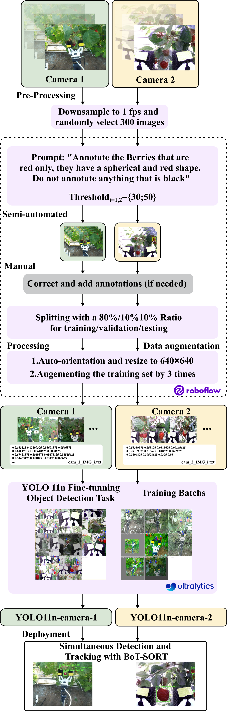

# 🤖🍇 Vision-Guided Agricultural Tasks with Diffusion-Based Motion Learning Using a Human-Robot Collaborative System

## 📋 Pipeline Overview

<p align="center">
    
    <br>
    <span align="center"><em>Pipeline for fine-tuning the pre-trained YOLOv11 nano model. Notice that only the grey box require human involved</em></span>
</p>


## 🚀 Getting Started

Follow these steps to set up your environment:

#### 1. 📥 Clone the repository

```bash
git clone https://github.com/alessiodesogus/agricultural-cobot.git
cd agricultural-cobot
```

#### 2. 🐍 Create a conda environment

```bash
conda create -n agricobot python=3.10
conda activate agricobot
```

#### 3. 📦 Install the required dependencies

```bash
pip install -r requirements.txt
```

**Dependencies included:**
- `ultralytics` - YOLOv11 implementation
- `tqdm` - Progress bars for training visualization
- `gdown` - Google Drive downloads for datasets

#### 4. 📁 Download datasets and models

```bash
cd scripts/
sh yolo_datasets_download.sh
sh yolo_models_download.sh
cd ..
```

### 🗂️ Data Folder Organization

Your `data/` folder should be organized as follows for proper training:

```
data/
├── camera_1/                          # 📷 Camera 1 dataset
│   ├── data.yaml                      # 📄 Dataset configuration
│   ├── README.dataset.txt             # 📖 Dataset documentation
│   ├── README.roboflow.txt            # 🤖 Roboflow export info
│   ├── train/                         # 🏋️ Training data
│   │   ├── images/                    # 🖼️ Training images
│   │   │   ├── IMG_001.jpg
│   │   │   ├── IMG_002.jpg
│   │   │   └── ...
│   │   ├── labels/                    # 🏷️ YOLO format labels
│   │   │   ├── IMG_001.txt
│   │   │   ├── IMG_002.txt
│   │   │   └── ...
│   ├── valid/                         # ✅ Validation data
│   │   ├── images/                    # 🖼️ Validation images
│   │   └── labels/                    # 🏷️ Validation labels
│   └── test/                          # 🧪 Test data
│       ├── images/                    # 🖼️ Test images
│       └── labels/                    # 🏷️ Test labels
└── camera_2/                          # 📷 Camera 2 dataset
    ├── data.yaml                      # 📄 Dataset configuration
    ├── README.dataset.txt             # 📖 Dataset documentation
    ├── README.roboflow.txt            # 🤖 Roboflow export info
    ├── train/                         # 🏋️ Training data
    │   ├── images/
    │   └──labels/
    ├── valid/                         # ✅ Validation data
    │   ├── images/
    │   └── labels/
    └── test/                          # 🧪 Test data
        ├── images/
        └── labels/
```

- **Images**: JPG format, various resolutions supported
- **Labels**: YOLO format (.txt files) with normalized coordinates
- **Classes**: Currently configured for `Riped berries` (class 0)
- **Split**: Organized into train/valid/test folders for proper evaluation


### 🚂 Training with Python Script

The Python script provides a streamlined command-line interface for training:

```bash
cd training/

# Basic training for camera 1
python yolov11n_finetuning.py --cam_id 1

# Custom parameters for camera 2
python yolov11n_finetuning.py --cam_id 2 --epochs 10 --batch_size 16 --image_size 640
```

| Parameter | Description | Default | Example |
|-----------|-------------|---------|---------|
| `--cam_id` | Camera ID (1 or 2) | Required | `--cam_id 1` |
| `--epochs` | Number of training epochs | 5 | `--epochs 25` |
| `--batch_size` | Training batch size | 8 | `--batch_size 16` |
| `--image_size` | Input image size | 1280 | `--image_size 640` |

### 📊 Training with Jupyter Notebook

For interactive development and visualization, follow the Jupyter Notebook stored at:

```bash
training/yolov11n_finetuning.ipynb
```


## 🎯 Results

After training, you'll find results in:

```
runs/detect/camera_{cam_id}/
├── yolov11n_train/                   # 🏋️ Training results
│   ├── weights/
│   │   ├── best.pt                   # 🏆 Best model weights
│   │   └── last.pt                   # 📝 Latest checkpoint
│   ├── results.png                   # 📈 Training curves
│   ├── confusion_matrix.png          # 🎯 Performance matrix
│   └── ...
├── yolov11n_eval/                    # ✅ Evaluation results
│   ├── confusion_matrix.png
│   ├── results.csv
│   └── ...
└── yolov11n_inference/               # 🔮 Inference results
```

## Acknowledgments

- **[Ultralytics](https://ultralytics.com/)**: For the YOLOv11 implementation  
- **[Roboflow](https://roboflow.com/)**: For dataset management and export tools

---

🌱 **Happy farming with AI!** 🤖🍇